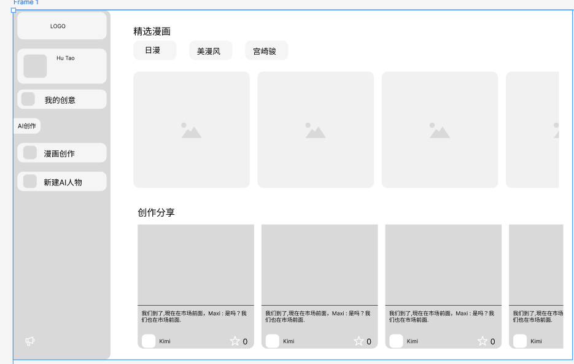
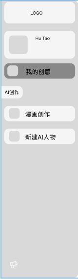
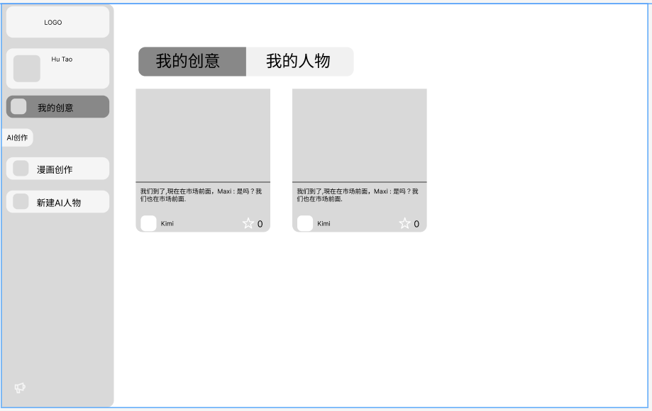
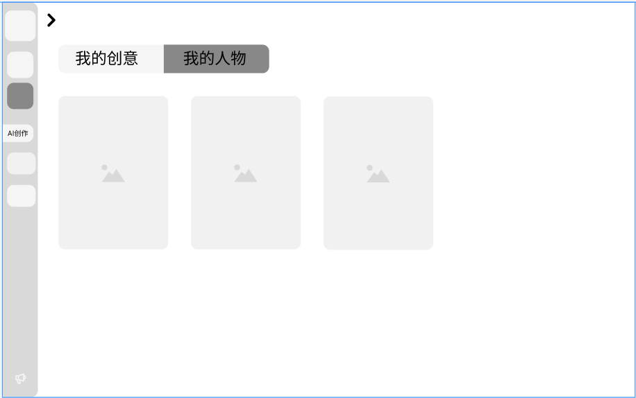

# 主页

整体的页面分为左右两侧，左侧是可折叠的navigation栏，右侧是内容展示区。
主页展示：
两个section，一个精选漫画，一个创作分享。详情请查询figma设计稿。

# 导航栏

导航栏分为四个部分：
- 顶部：logo和用户信息 我的创意
- 中部：AI创作（只是区分section，不是点击的按钮，贴在最左侧）
- 下部：导航按钮：漫画创作、新建AI人物
- 底部：消息按钮

折叠形态下只显示icon，展开形态下显示icon和文字说明。详情请查询figma设计稿。

#  我的创意

我的创意页面分为两个tab，分别是“我的创意”和“我的人物”
- 我的创意：展示用户所有的创意作品
- 我的人物：展示用户所有的AI人物
- 详情请查询figma设计稿

# 漫画创作

漫画创作页面分为三个tab，分别是 故事、人物、生图

- 故事：展示当前漫画故事，左侧是输入故事的card，右侧是AI模型、漫画风格、漫画网格布局

底部为下一步按钮

- 人物：展示当前漫画人物，根据故事识别到的角色可以被选择，右侧是一件选择人物的按钮，底部为下一步按钮

最后到生图，左侧是01 02这样的漫画格子，中间是漫画预览，右侧是更多的信息card，如出镜人物、文本、会画框、PDF导出和图片导出

# 新建AI人物
等做好前面的内容，再补充这个页面的设计说明