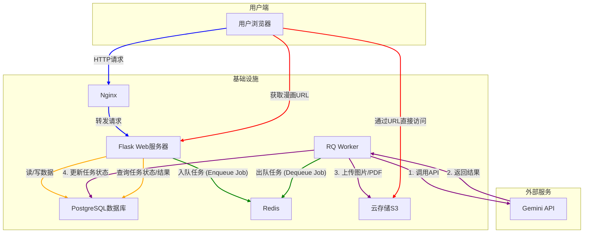

# MangaSuperb 后端系统设计

本文总结当前后端的整体结构、模块责任、关键数据表以及主要 API 流程，便于新成员快速理解项目架构。英文见 `docs/system_design_EN.md`

---

## 1. 架构概览



- **Flask API (`app.py`)**：提供 REST 接口、认证、业务校验；所有耗时操作都转交 RQ。
- **RQ Worker (`worker.py`)**：在应用上下文中执行 `mangasuperb/services/jobs.py`，负责 Gemini 文本/图像生成、PDF/ZIP 导出等。
- **PostgreSQL**：存储用户、角色、脚本、漫画及其子表（页面、布局、阶段状态等）。
- **Redis**：既作为 Session 缓存（Flask-Login 使用 cookie）也作为 RQ 的队列与 registry。
- **Cloudflare R2**：保存生成的角色图片、漫画页面、封面和导出文件。
- **Gemini API**：用于脚本生成、角色优化、图像生成、封面生成。

---

## 2. 模块职责

| 模块/文件 | 职责描述 |
|-----------|----------|
| `mangasuperb/routes/auth.py` | 注册/登录、更新邮箱/用户名/密码、返回当前用户信息 |
| `mangasuperb/routes/characters.py` | 角色 CRUD；可请求文本优化及角色图像生成（含 RQ 任务） |
| `mangasuperb/routes/scripts.py` | 自定义脚本保存与列表查询 |
| `mangasuperb/routes/comics.py` | 漫画创建（同步写入 Script + Comic + 角色关联）、列表、详情、发布（导出） |
| `mangasuperb/routes/jobs.py` | `/api/jobs` 动态分发：漫画生成、脚本优化、角色优化、页面重渲染；提供 `/api/jobs/<id>` 状态查询并返回 `worker_snapshot` |
| `mangasuperb/routes/system.py` | `/health` 增强版：返回 database / redis / r2 / rq_workers 状态；根路径提供 SPA |
| `mangasuperb/services/generation.py` | 封装 Gemini 文本交互、角色描述优化、图片参考校验、宽高比校验 |
| `mangasuperb/services/jobs.py` | RQ 任务实现：从脚本生成、角色图像、页面渲染，到导出 PDF/ZIP、封面生成、发布 |
| `mangasuperb/extensions.py` | 初始化 SQLAlchemy、Bcrypt、LoginManager、Redis/RQ Queue |

---

## 3. 关键数据表

| 表名 | 说明 | 关联合约 |
|------|------|---------|
| `users` | 用户账号（唯一 username、email、avatar_index） | 拥有 `characters`、`scripts`、`comics` |
| `characters` | 角色描述、样式提示、性别、公共标记；可记录 RQ 图像任务 | 与 `comic_characters` 多对多 |
| `scripts` | 手动或自动生成的脚本 JSON | 被 `comics` 引用 |
| `comics` | 漫画元数据（状态、样式说明、aspect_ratio、导出链接、封面等） | 关联 `scripts`、`comic_pages`、`comic_panel_shots` 等 |
| `comic_pages` | 每页渲染结果（image_url、panel_text）并与脚本建立追踪 | `script_id` 外键追溯来源 |
| `comic_panel_shots` | 面板描述、台词等；可映射到页面和布局 | 关联 `comic_page_layouts` |
| `comic_page_layouts` / `comic_page_panels` | 用户或系统选择的布局与面板排序 | 支持手动调整后触发重新渲染 |
| `comic_workflow_stages` | outline/shots/render/export 等阶段的 job_id、状态、时间戳、错误信息 | 用于 `/api/jobs/<id>` 与 UI 展示 |
| `comic_characters` | 漫画与角色的桥表，记录 order/role 等 | |
| `comic_likes` | 用户对漫画的点赞记录 | (`user_id`, `comic_id`) 唯一；用于热度排行 |

---

## 4. 队列流程与日志

1. **漫画生成 (`/api/jobs` with `comic_generation`)**  
   - API 写入 Script + Comic，并立即调用 `enqueue_comic_workflow`：  
     outline → shots → render（最后一个 job_id 会回传给前端）。  
   - 工作进度可在 `/api/jobs/<render_job_id>` 查看，返回结构示例：  
     ```json
     {
       "job_id": "...",
       "rq_status": "finished",
       "comic": { ... },
       "worker_snapshot": {
         "status": "active",
         "active": 2,
         "workers": ["manga-worker-136759", "manga-worker-135194"],
         "queued": 0,
         "deferred": 0,
         "failed": 6
       }
     }
     ```
   - 如果 `active` 为 0，会在响应中附带 warning，提醒 worker 未运行。

2. **页面重渲染**  
   - `POST /api/panels/<comic_id>/layouts` 先调整布局；随后 `POST /api/panels/<comic_id>/pages/<page>/render` 入队再渲染单页。

3. **角色图像生成**  
   - `POST /api/characters` 附带 `reference_images` 时会调用 `process_character_image_generation`，完成后写入 `image_url`。

4. **导出与发布**  
   - `POST /api/comics/<id>/publish` 顺序：封面生成 → 导出 PDF/ZIP → finalize。  
   - `process_export_stage` 会在开头插入 `cover.png`，PDF 第一页即封面，ZIP 包含封面 + page-XXX.png。  
   - 发布完成后可设置 `make_public=true` 让漫画出现在 `/api/comics/public`。

5. **健康检查**  
   - `/health` 返回 `rq_workers.status` / `active` / `workers` 数组，便于确认队列是否存在 worker实例。

---

## 5. 安全与配置

- 所有密钥必须放在 `.env`；不要把.env或API key上传到仓库。
- R2 资源当前默认公开访问。
- Gemini 请求需处理失败重试；若凭证缺失，任务会抛 `RuntimeError` 并更新阶段状态为失败。
- 角色/漫画导出需确认 R2 Bucket 可写、且 `R2_PUBLIC_URL` 正确配置以生成可点击的公共链接。

---

## 6. 日志排查指南

- 所有 RQ 任务在 `mangasuperb/services/jobs.py` 都记录 `=== ... job_id=... ===`，首尾各一条。
- 失败时，会通过 `logger.exception` 保存堆栈，并更新 `comic.character` 等模型的 `image_error`、`workflow_stages.error_message`。
- 如果 `/api/jobs/<id>` 显示 `rq_status: "failed"`，请检查 worker 终端日志以及 R2/Gemini 凭证。

---

## 7. 后续工作

- 前端如需同步展示队列进度，可直接使用 `/api/jobs/<id>` 的 `worker_snapshot` 和 `comic.workflow_stages`。
- 添加新类型的任务时，记得更新 `swagger.py` 中 `JOB_CREATE_DOC` 和 `JOB_STATUS_DOC`。

