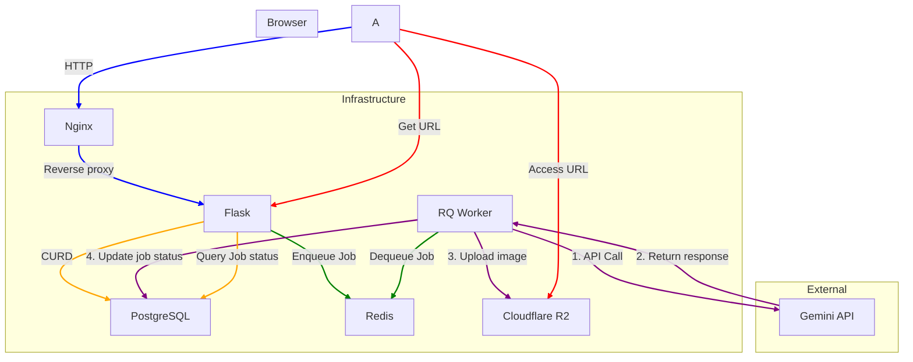

# MangaSuperb system design

This document captures how requests traverse the modernised backend and the shared services that support manga creation, regeneration, and download flows.

## High-level architecture

### Request lifecycle

1. **Authentication** – Credentials are posted to `/api/auth/*` and processed by the auth blueprint. Flask-Login stores the session cookie which is reused by subsequent requests.
2. **Scripting & character creation** – Authoring routes live under `/api/scripts` and `/api/characters`. They persist raw JSON payloads to PostgreSQL and optionally call Gemini synchronously for lightweight optimisation.
3. **Comic generation** – `/api/jobs` collects the story prompt, persists a pending `Comic` + `Script`, and enqueues a background job in Redis. The immediate API response returns the job id alongside the generated outline so the UI can present it instantly.
4. **Background processing** – The RQ worker loads the same job implementation (`mangasuperb.services.jobs`) used by the API. It calls Gemini image models, uploads the results to Cloudflare R2, and updates the comic status plus generated pages.
5. **Retrieval & download** – Clients poll `/api/jobs/<id>` for status updates or fetch `/api/comics/<id>` once the PDF/assets are ready. Because R2 URLs are persisted, subsequent downloads do not require recomputation.

### Module responsibilities

- **`mangasuperb/__init__.py`** – Application factory that wires extensions, blueprints, Swagger, logging, and shared storage/queue clients.
- **`mangasuperb/extensions.py`** – Central definitions for SQLAlchemy, bcrypt, login manager, CORS, and RQ queue initialisation.
- **`mangasuperb/routes/*`** – Thin HTTP layers focused on validation, persistence, and orchestrating services for each domain.
- **`mangasuperb/services/generation.py`** – Gemini helpers for script creation, character optimisation, payload validation, and aspect ratio enforcement.
- **`mangasuperb/services/jobs.py`** – Background job implementations reused by the API and worker so asynchronous logic stays in sync.
- **`worker.py`** – Minimal bootstrap that creates the Flask app, pushes an application context, and starts the RQ worker loop.

### Scaling considerations

- **Horizontal API scaling** – The stateless blueprint architecture allows multiple Flask instances to be started behind a load balancer. Sessions are backed by secure cookies, while shared resources (PostgreSQL, Redis, R2) remain external.
- **Job throughput** – Additional worker processes can be launched by calling `python worker.py` in separate containers or machines. Because the job logic is pure Python with explicit context management, no extra configuration is needed.
- **Future extensions** – Additional services (PDF renderer, collaborative editing, analytics) can be added as new blueprints or background jobs without modifying the existing modules. The `docs/system_design.md` diagram should be updated as new dependencies join the flow.

### Data entities

| Entity      | Purpose                                                   | Key relationships |
|-------------|-----------------------------------------------------------|-------------------|
| `User`      | Authenticates artists and writers via username/password.  | Owns scripts, characters, comics. |
| `Script`    | Stores the structured outline returned by Gemini.         | Linked to comics. |
| `Comic`     | Tracks generation status, style, aspect ratio, and PDFs.  | References a script and collection of pages. |
| `ComicPage` | Individual rendered pages generated by the worker.        | Belongs to a comic. |
| `Character` | Optional character bios and generated portraits.          | Owned by a user and may queue its own job. |

This shared mental model should make it straightforward to onboard contributors, reason about failure modes, and plan for future scalability milestones.
