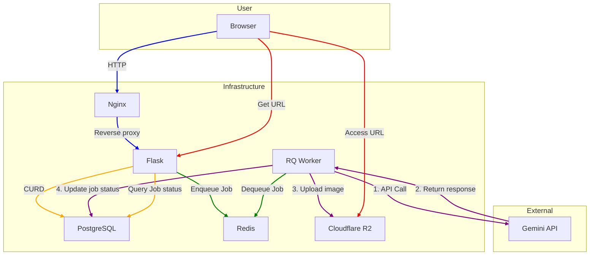

# MangaSuperb system design

This document captures how requests traverse the modernised backend and the shared services that support manga creation, regeneration, and download flows.

## High-level architecture

### Request lifecycle

1. **Authentication** – Credentials are posted to `/api/auth/*` and processed by the auth blueprint. Flask-Login stores the session cookie which is reused by subsequent requests.
2. **Scripting & character creation** – Authoring routes live under `/api/scripts` and `/api/characters`. They persist raw JSON payloads to PostgreSQL and optionally call Gemini synchronously for lightweight optimisation.
3. **Comic generation** – `/api/jobs` collects the story prompt, persists a pending `Comic` + `Script`, and enqueues the staged workflow in Redis. Per `mangasuperb/routes/jobs.py:create_job`, the immediate API response returns the job id and generated script while outline, shot, and render stages continue asynchronously.
4. **Background processing** – The RQ worker loads the same job implementation (`mangasuperb.services.jobs`) used by the API. It calls Gemini image models, uploads the results to Cloudflare R2, and updates the comic status plus generated pages.
5. **Retrieval & download** – Clients poll `/api/jobs/<id>` for status updates or fetch `/api/comics/<id>` once the PDF/assets are ready. Because R2 URLs are persisted, subsequent downloads do not require recomputation.

### Module responsibilities

- **`mangasuperb/__init__.py`** – Application factory that wires extensions, blueprints, Swagger, logging, and shared storage/queue clients.
- **`mangasuperb/extensions.py`** – Central definitions for SQLAlchemy, bcrypt, login manager, CORS, and RQ queue initialisation.
- **`mangasuperb/routes/*`** – Thin HTTP layers focused on validation, persistence, and orchestrating services for each domain.
- **`mangasuperb/services/generation.py`** – Gemini helpers for script creation, character optimisation, payload validation, and aspect ratio enforcement.
- **`mangasuperb/services/jobs.py`** – Background job implementations reused by the API and worker so asynchronous logic stays in sync.
- **`worker.py`** – Minimal bootstrap that creates the Flask app, pushes an application context, and starts the RQ worker loop.

## API endpoints

### System

| Endpoint | Method | Description | Auth |
|----------|--------|-------------|------|
| `/` | GET | Serves the SPA entry (`static/index.html`). | Not required |
| `/health` | GET | Liveness and dependency check for database, Redis, and R2. | Not required |
| `/api/docs.json` | GET | Swagger definition used by Swagger UI. | Not required |

- **Request parameters** – none (public endpoints).
- **Response fields** – optional status blocks per dependency, including `rq_workers` with active worker details.

### Authentication

| Endpoint | Method | Description | Auth |
|----------|--------|-------------|------|
| `/api/auth/register` | POST | Create an account; enforces unique username and email, returns logged-in session. | No |
| `/api/auth/login` | POST | Authenticate with username or email plus password; issues session cookie. | No |
| `/api/auth/logout` | POST | Invalidate the active session. | Yes |
| `/api/auth/me` | GET | Return the current user profile or `null`. | Optional |
| `/api/auth/username` | PATCH | Update username after validation and uniqueness checks. | Yes |
| `/api/auth/email` | PATCH | Update email address with format and uniqueness enforcement. | Yes |
| `/api/auth/password` | PATCH | Change password by submitting current and new secrets. | Yes |

- **POST /api/auth/register** – Required JSON: `username`, `email`, `password`. Optional: none. Returns `user`.
- **POST /api/auth/login** – Required JSON: `password` plus one of `username` or `email`. Optional: remember flags (future). Returns `user`.
- **PATCH /api/auth/username** – Required JSON: `username`. Optional: none. Returns `user`.
- **PATCH /api/auth/email** – Required JSON: `email`. Optional: none. Returns `user`.
- **PATCH /api/auth/password** – Required JSON: `current_password`, `new_password`. Optional: none. Returns `message`.
- **GET /api/auth/me** – No parameters. Returns `user` or `null`.

### Characters

| Endpoint | Method | Description | Auth |
|----------|--------|-------------|------|
| `/api/characters` | POST | Create a character; optional optimisation and reference images enqueue portrait jobs and return `job_id`. | Yes |
| `/api/characters` | GET | List characters owned by the user plus any marked `is_public`. | Yes |
| `/api/characters/<id>` | GET | Retrieve a single character owned by the user. | Yes |

- **POST /api/characters** – Required JSON: `description`. Optional: `name` (defaults to `unspecified`), `sex` (default `unspecified`), `is_public`, `optimize`, `style_prompt`, `reference_images`. Returns `character`, optional `job_id`.
- **GET /api/characters** – Optional query: none; returns `characters` including public roster.
- **GET /api/characters/<id>** – Path `id` required; returns `character`.

### Scripts

| Endpoint | Method | Description | Auth |
|----------|--------|-------------|------|
| `/api/scripts` | POST | Save a custom script draft (title + JSON content). | Yes |
| `/api/scripts` | GET | List recent scripts for the current user (max 100). | Yes |
| `/api/scripts/<id>` | GET | Fetch a single script owned by the user. | Yes |

- **POST /api/scripts** – Required JSON: `title`, `content` (stringified JSON). Optional: none. Returns `script`.
- **GET /api/scripts** – Optional query: `limit` (default 50, max 100). Returns `scripts`, `count`.
- **GET /api/scripts/<id>** – Path `id` required; returns `script`.

### Comics

| Endpoint | Method | Description | Auth |
|----------|--------|-------------|------|
| `/api/comics` | POST | Create a comic with associated script, aspect ratio, and optional character roster. | Yes |
| `/api/comics` | GET | List comics belonging to the current user. | Yes |
| `/api/comics/<id>` | GET | Retrieve a specific comic, including generated pages and status. | Yes |

- **POST /api/comics** – Required JSON: `title`, `story` (or `script_content`), `style` (or `style_description`), `aspect_ratio`. Optional: `characters`, `character_ids`, `style_description`. Returns `comic`, `script`.
- **GET /api/comics** – Optional query: `user_id` (must match self). Returns `comics`, `count`.
- **GET /api/comics/<id>** – Path `id` required; returns `comic`.

### Stories, panels, and rendering

| Endpoint | Method | Description | Auth |
|----------|--------|-------------|------|
| `/api/stories/<comic_id>` | GET | Return the comic payload including outline, panels, and pages. | Yes |
| `/api/stories/<comic_id>` | POST | Replace outline sections, optionally reassign characters, and reset workflow stages. | Yes |
| `/api/stories/<comic_id>/optimize` | POST | Enqueue Gemini outline optimisation for the comic. | Yes |
| `/api/panels/<panel_id>` | PATCH | Update panel metadata (text, ordering, status) and flag the render stage pending. | Yes |
| `/api/panels/<comic_id>/layouts` | POST | Select a page layout and panel order, marking the comic for re-render. | Yes |
| `/api/panels/<comic_id>/pages/<page_number>/render` | POST | Enqueue a specific page render job. | Yes |

- **GET /api/stories/<comic_id>** – Path `comic_id` required; returns `comic`.
- **POST /api/stories/<comic_id>** – Required JSON: `sections` (non-empty list). Optional: `characters`, `character_ids`. Returns `comic`.
- **POST /api/stories/<comic_id>/optimize** – Path `comic_id`; no body. Returns `stage_jobs`, `comic`.
- **PATCH /api/panels/<panel_id>** – Path `panel_id`; body optional fields among `description`, `dialogue`, `camera_notes`, `style_notes`, `status`, `page_number`, `panel_number`. Returns `panel`, `comic`.
- **POST /api/panels/<comic_id>/layouts`** – Path `comic_id`; required body: `page_number`. Optional: `layout_key`, `notes`, `panel_order`. Returns `layout`, `comic`.
- **POST /api/panels/<comic_id>/pages/<page_number>/render`** – Path params required; body optional. Returns `job_id`, `comic`.

### Jobs

| Endpoint | Method | Description | Auth |
|----------|--------|-------------|------|
| `/api/jobs` | POST | Dispatch background work (`comic_generation`, `story_optimization`, `character_optimization`, `page_render`). | Yes |
| `/api/jobs/<job_id>` | GET | Inspect queued or completed job status and associated payloads. | Yes |

- **POST /api/jobs** – Required JSON varies by `job_type`:  
  - `comic_generation` requires `prompt`; optional `style`, `aspect_ratio`, `characters`.  
  - `story_optimization` requires `comic_id`.  
  - `character_optimization` requires `character_id`, optional `description`.  
  - `page_render` requires `comic_id`, `page_number`.  
  Returns `job_id`, plus comic/script payloads per workflow.
- **GET /api/jobs/<job_id>** – Path `job_id` required; returns `job_id`, `rq_status`, optional `comic`/`character`.
- Export jobs prepend the generated cover image (when available) to PDFs/ZIP bundles so downstream downloads start with the cover.

### Scaling considerations

- **Horizontal API scaling** – The stateless blueprint architecture allows multiple Flask instances to be started behind a load balancer. Sessions are backed by secure cookies, while shared resources (PostgreSQL, Redis, R2) remain external.
- **Job throughput** – Additional worker processes can be launched by calling `python worker.py` in separate containers or machines. Because the job logic is pure Python with explicit context management, no extra configuration is needed.
- **Future extensions** – Additional services (PDF renderer, collaborative editing, analytics) can be added as new blueprints or background jobs without modifying the existing modules. The `docs/system_design.md` diagram should be updated as new dependencies join the flow.

### Data entities

| Entity      | Purpose                                                   | Key relationships |
|-------------|-----------------------------------------------------------|-------------------|
| `User`      | Authenticates artists and writers via username/password.  | Owns scripts, characters, comics. |
| `Script`    | Stores the structured outline returned by Gemini.         | Linked to comics. |
| `Comic`     | Tracks generation status, style, aspect ratio, and PDFs.  | References a script and collection of pages. |
| `ComicPage` | Individual rendered pages generated by the worker.        | Belongs to a comic. |
| `Character` | Optional character bios and generated portraits.          | Owned by a user and may queue its own job. |
| `ComicWorkflowStage` | Tracks outline, shot, and render stage status for a comic. | Belongs to a comic; one row per stage with timing metadata. |
| `ComicOutlineSection` | Stores ordered outline beats derived from the prompt. | Belongs to a comic; linked to panel shots. |
| `ComicPanelShot` | Describes individual panels including dialogue and style notes. | Belongs to a comic; optionally tied to an outline section and page assignments. |
| `ComicPageLayout` | Records page-level layout selections and panel placement. | Belongs to a comic; owns ordered `ComicPagePanel` assignments and may reference a rendered page. |
| `ComicPagePanel` | Maps panel shots to positions within a page layout. | Belongs to a page layout and references a `ComicPanelShot`. |
| `ComicCharacter` | Joins characters to comics with roles and ordering.  | Many-to-many bridge between `Comic` and `Character`. |

This shared mental model should make it straightforward to onboard contributors, reason about failure modes, and plan for future scalability milestones.

## Database schema

### `users`
- `id` PK, auto-increment.
- `username` unique, indexed length ≤ 80; enforced uniqueness at DB and application level.
- `email` unique, indexed length ≤ 255; login accepts either username or email.
- `password_hash`, `avatar_index`, `created_at`.
- Cascading deletes remove child `characters`, `scripts`, and `comics`.

### `characters`
- `id` PK, `user_id` FK → `users.id` (`CASCADE` on delete).
- Required `description`; `name` defaults to `'unspecified'` when omitted so users can rename later.
- Flags: `is_public` (indexed) and `image_status` for queue tracking.
- Optional: `style_prompt`, `optimized_description`, `image_url`, `image_job_id`, `image_error`.
- Relationship: many characters per user; joined to comics via `comic_characters`.

### `scripts`
- `id` PK, `user_id` FK → `users.id` (`CASCADE`).
- Required `title`, `content` (JSON string).
- Relationship: one user owns many scripts; each script may back multiple comics.

### `comics`
- `id` PK, `user_id` FK → `users.id`, `script_id` FK → `scripts.id` (both `CASCADE`).
- Workflow columns: `status`, `workflow_stage`, `workflow_status`, timestamps, optional `job_id` (unique), `error_message`.
- Presentation data: `title`, `style_description`, `aspect_ratio`, optional `pdf_url`.
- Relationships: one comic has many pages, stages, outline sections, panel shots, page layouts, and `comic_characters`.

### `comic_characters`
- Bridge table: `comic_id` FK → `comics.id`, `character_id` FK → `characters.id` (both `CASCADE`).
- `order_index` (display ordering) and optional `role`.
- Unique constraint `uq_comic_character_link` prevents duplicate assignments of the same character to a comic.

### `comic_pages`
- `id` PK, `comic_id` FK → `comics.id` (`CASCADE`), `script_id` FK → `scripts.id` (`CASCADE`).
- `page_number` + `comic_id` unique (`unique_comic_page`), enforcing one rendered asset per page per comic.
- Stores `image_url`, optional `panel_text`, and maintains a direct script reference for traceability.
- Linked from `comic_page_layouts.comic_page_id`.

### `comic_workflow_stages`
- `id` PK, `comic_id` FK → `comics.id` (`CASCADE`).
- `stage` (outline/shots/render) constrained at application level; unique per comic (`unique_comic_stage`).
- Tracks `status`, optional `job_id`, timestamps, `error_message`.

### `comic_outline_sections`
- `id` PK, `comic_id` FK → `comics.id` (`CASCADE`).
- `order_index` unique per comic (`unique_outline_order`), with optional `title`, required `summary`.
- Backref: `panel_shots` (one-to-many).

### `comic_panel_shots`
- `id` PK, `comic_id` FK → `comics.id` (`CASCADE`), `outline_section_id` FK → `comic_outline_sections.id` (`SET NULL`).
- Unique `sequence_index` per comic (`unique_panel_sequence`); optional `page_number` / `panel_number`.
- Stores description, dialogue, camera/style notes, status, timestamps.
- Backref from `comic_page_panels` for layout placement.

### `comic_page_layouts`
- `id` PK, `comic_id` FK → `comics.id` (`CASCADE`), optional `comic_page_id` FK → `comic_pages.id` (`SET NULL`).
- Unique `page_number` per comic (`unique_layout_page`).
- Fields: `layout_key`, `notes`, `status`, optional `selected_at`.
- One-to-many with `comic_page_panels`.

### `comic_page_panels`
- `id` PK, `page_layout_id` FK → `comic_page_layouts.id` (`CASCADE`), `panel_shot_id` FK → `comic_panel_shots.id` (`CASCADE`).
- `position` integer; unique constraints on `(page_layout_id, position)` and `(page_layout_id, panel_shot_id)` enforce ordering without duplicates.

### Queue-related helpers
- Characters store `image_job_id`; comics track pipeline via `job_id` plus `comic_workflow_stages`.
- All job IDs refer to Redis RQ identifiers stored as strings; foreign keys are not enforced for jobs, keeping queue coupling loose.
